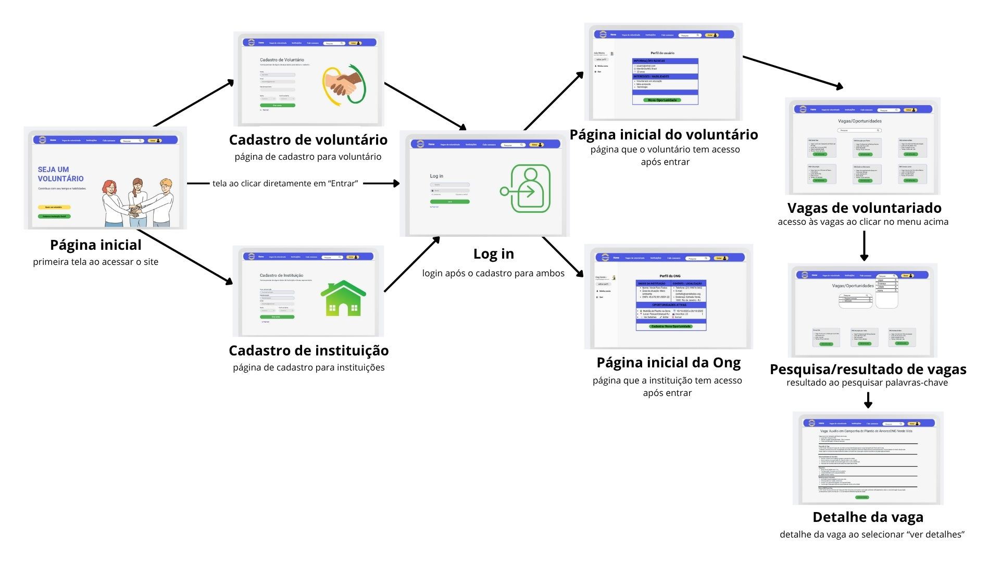

# Projeto de Interface
Visão Geral

O projeto de interface da plataforma de voluntariado foi concebido de forma a proporcionar uma experiência clara, intuitiva e acessível, em conformidade com os requisitos funcionais e não funcionais levantados na documentação de especificação. O objetivo principal foi garantir que tanto voluntários quanto organizações sociais consigam realizar suas atividades de forma ágil e sem barreiras, aumentando a efetividade da conexão entre ambos.

A navegação foi estruturada com base em fluxos simples, permitindo que o usuário atinja seus objetivos em poucos cliques. Essa decisão atende aos requisitos não funcionais de usabilidade e navegação simplificada, ao mesmo tempo em que contempla requisitos funcionais como cadastro de usuários (RF-01, RF-02), visualização de oportunidades (RF-03), inscrição em vagas (RF-04), exibição de perfis (RF-05) e pesquisa de oportunidades (RF-06)

## User Flow
O fluxo de usuário (User Flow) elaborado pela equipe mapeia as principais ações que podem ser realizadas dentro da plataforma, garantindo coerência com as histórias de usuário definidas.

Fluxo do Voluntário

Página Inicial: acesso às principais opções da plataforma.

Cadastro Voluntário: preenchimento de informações pessoais e criação de conta.

Login Voluntário: autenticação para acesso às funcionalidades restritas.

Perfil Voluntário: exibição de dados pessoais e histórico de inscrições.

Pesquisar Vagas: busca de oportunidades por filtros e palavras-chave.

Detalhes da Vaga / Inscrição: visualização detalhada da oportunidade e confirmação de participação.

Fluxo da ONG

Página Inicial: acesso ao cadastro institucional.

Cadastro ONG: registro da instituição e área de atuação.

Login ONG: autenticação de acesso.

Perfil ONG: área administrativa para cadastro de novas vagas e acompanhamento de inscrições.

Esse fluxo garante a separação clara dos caminhos de cada perfil de usuário e está diretamente alinhado às histórias de usuário descritas no documento, permitindo tanto o voluntário quanto a instituição cumprir seus objetivos principais na plataforma.

> **Links Úteis**:
> - [User Flow: O Quê É e Como Fazer?](https://medium.com/7bits/fluxo-de-usu%C3%A1rio-user-flow-o-que-%C3%A9-como-fazer-79d965872534)
> - [User Flow vs Site Maps](http://designr.com.br/sitemap-e-user-flow-quais-as-diferencas-e-quando-usar-cada-um/)
> - [Top 25 User Flow Tools & Templates for Smooth](https://www.mockplus.com/blog/post/user-flow-tools)

## Wireframes

São protótipos usados em design de interface para sugerir a estrutura de um site web e seu relacionamentos entre suas páginas. Um wireframe web é uma ilustração semelhante do layout de elementos fundamentais na interface e é fundamental sempre relacionar cada wireframe com o(s) requisito(s) que ele atende.

### Exemplo

A tela inicial apresenta um menu lateral com as principais seções do portal, enquanto a navigation bar, ao topo, apresenta informações de envio de imagens ou navegação pela galeria de fotos. A área central apresenta a galeria de fotos na forma de uma grade. Nesta tela, são apresentados os seguintes requisitos

 
> **Links Úteis**:
> - [Protótipos vs Wireframes](https://www.nngroup.com/videos/prototypes-vs-wireframes-ux-projects/)
> - [Ferramentas de Wireframes](https://rockcontent.com/blog/wireframes/)
> - [MarvelApp](https://marvelapp.com/developers/documentation/tutorials/)
> - [Figma](https://www.figma.com/)
> - [Adobe XD](https://www.adobe.com/br/products/xd.html#scroll)
> - [Axure](https://www.axure.com/edu) (Licença Educacional)
> - [InvisionApp](https://www.invisionapp.com/) (Licença Educacional)
